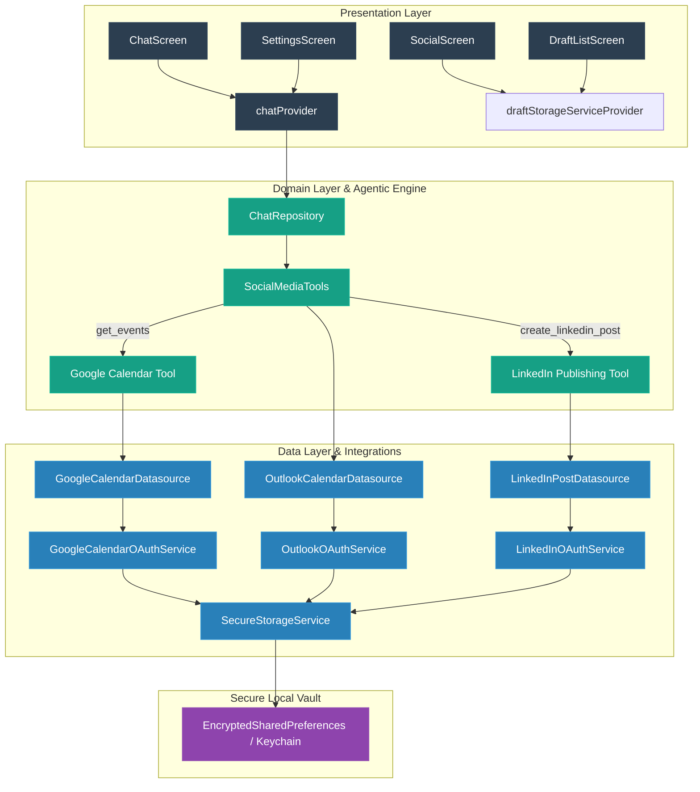

# 🐝 SpeeHive Social — Agentic AI Social Media Planner & Automation Suite

[](https://flutter.dev)
[](https://dart.dev)
[](https://openai.com)
[](https://riverpod.dev)
[](#)
[](#)

SpeeHive Social is an enterprise-grade mobile application designed to bridge professional schedule management with automatic social marketing. Built using **Flutter** and **Dart**, this app integrates calendar scheduling systems (Google Calendar & Outlook Calendar) with social media posting engines (LinkedIn REST API), orchestrated dynamically by an **Agentic AI Core** using tool calling and real-time streaming interfaces.

Rather than relying on typical text prompts, SpeeHive Social uses an autonomous agent capable of deciding *when* and *how* to query calendars, generate structured drafts in multiple tones, format media payloads, and trigger direct social publishes.

---

## 🏗️ Architecture & Interaction Flow

The project is structured according to **Clean Architecture** patterns combined with **Riverpod** for declarative Dependency Injection and State Management. This enforces separation of concerns across four discrete layers:
- **Presentation**: UI screens, widgets, and state-managing Notifiers.
- **Domain**: Pure business entities, usecases, and AI tool definitions.
- **Data**: Remote and local data sources, API integrations, OAuth helpers, and repository implementations.
- **Core**: Global constants, app configurations, security constraints, and themes.



---

## ⚡ Technical Complexities & Implementation Highlights

### 1. Agentic AI & Tool-Calling Pipeline
SpeeHive Social leverages a port of the Vercel AI SDK ([ai_sdk_dart](https://pub.dev/packages/ai_sdk_dart)) to perform multi-turn conversational reasoning and tool calling:
* **JSON Schema Declarations**: Custom local tools (defined in [SocialMediaTools](file:///mnt/c/workspace/speehive_social/lib/domain/tools/social_tools.dart)) declare precise JSON Schema specifications describing inputs, types, and constraints.
* **On-Step-Finish Interception**: As the assistant thinks and streams its answer, tool execution steps are intercepted in [ChatRepositoryImpl](file:///mnt/c/workspace/speehive_social/lib/data/repositories/chat_repository_impl.dart) using step callbacks.
* **Real-time UI Syncing**: Active tool calls are captured and exposed immediately to the UI layer via [ChatNotifier](file:///mnt/c/workspace/speehive_social/lib/presentation/chat/notifier/chat_notifier.dart). The UI renders custom execution bubbles displaying current status (spinner during execution, checkmark on completion).

### 2. Dual-Provider Calendar Sync with Automatic Fallback
The calendar integration is designed with a fault-tolerant architecture (implemented in [EventCheckService](file:///mnt/c/workspace/speehive_social/lib/core/services/event_check_service.dart)):
* **Hierarchical Checking**: The service attempts to query the primary provider (**Google Calendar**) via OAuth REST client.
* **Dynamic Failure Handling**: If the Google Calendar query fails or has expired authorization, it gracefully catches the error and redirects the queries to the fallback provider (**Microsoft Graph / Outlook Calendar**).
* **Caching & Freshness**: To prevent redundant API calls, a timestamped local cache is updated using secure storage to track calendar status.

### 3. Comprehensive Three-Legged LinkedIn Publishing Engine
Posting content to professional platforms like LinkedIn requires complex multi-step processing:
* **URN Discovery**: Author identification is managed dynamically by retrieving profile payloads and identifying the target Person URN.
* **Binary Media Multi-Part Upload**: Images are published in two stages:
  1. Registering the asset via an initialization query (`initializeUploadRequest`) to obtain an upload URL and reference URN.
  2. Uploading the raw binary data as an `application/octet-stream` block directly to LinkedIn's media servers.
* **Payload Assembly**: The final commentary, distribution settings, visibility overrides (e.g. `PUBLIC` or `CONNECTIONS`), and the successfully registered media URN are packaged into a structured POST payload to publish the update.

### 4. Hardware-Level Secure Storage
Managing client secrets, Google Client IDs, OpenAI keys, and OAuth access/refresh tokens requires high-level security:
* **Secure Storage**: Configured in [SecureStorageService](file:///mnt/c/workspace/speehive_social/lib/data/datasources/local/secure_storage_service.dart) using `flutter_secure_storage`.
* **Hardware Protection**: On Android devices, the service explicitly configures `EncryptedSharedPreferences` to leverage hardware keystores (RSA/AES), preventing memory dumping or unauthorized reads.

---

## 🛠️ Technology Stack & Dependencies

| Category | Technology / Package | Description |
| :--- | :--- | :--- |
| **Framework** | **Flutter & Dart SDK** | Multi-platform compilation and runtime environment. |
| **State & DI** | [flutter_riverpod](https://pub.dev/packages/flutter_riverpod) | Declarative state management, unidirectional data flow, and dependency injection. |
| **Agentic AI** | [ai_sdk_dart](https://pub.dev/packages/ai_sdk_dart) | Vercel AI SDK Dart port for stream-rendering and local function calling. |
| **OAuth Services**| `google_sign_in`, `googleapis`, `http` | Multi-provider OAuth tokens and REST integrations (Google Cloud & Microsoft Azure). |
| **Security** | [flutter_secure_storage](https://pub.dev/packages/flutter_secure_storage) | Hardware-backed keystore integration for token and parameter caching. |
| **UI Components**| `google_fonts`, `shimmer`, `animated_text_kit` | Modern typographic elements, bone loading structures, and typing animations. |

---

## 📁 Repository Structure & Key Components

Below is the directory mapping for SpeeHive Social, showing links to the core components of the codebase:

* 📂 [lib/](file:///mnt/c/workspace/speehive_social/lib)
  * 📂 [core/](file:///mnt/c/workspace/speehive_social/lib/core)
    * 📂 [di/](file:///mnt/c/workspace/speehive_social/lib/core/di)
      * 📄 [providers.dart](file:///mnt/c/workspace/speehive_social/lib/core/di/providers.dart) — Dependency injection declarations.
    * 📂 [services/](file:///mnt/c/workspace/speehive_social/lib/core/services)
      * 📄 [event_check_service.dart](file:///mnt/c/workspace/speehive_social/lib/core/services/event_check_service.dart) — Dual calendar sync service.
    * 📂 [themes/](file:///mnt/c/workspace/speehive_social/lib/core/themes)
      * 📄 [app_theme.dart](file:///mnt/c/workspace/speehive_social/lib/core/themes/app_theme.dart) — Theme definitions (Dark/Light mode).
  * 📂 [data/](file:///mnt/c/workspace/speehive_social/lib/data)
    * 📂 [datasources/](file:///mnt/c/workspace/speehive_social/lib/data/datasources)
      * 📂 [google/](file:///mnt/c/workspace/speehive_social/lib/data/datasources/google)
        * 📄 [google_calendar_datasource.dart](file:///mnt/c/workspace/speehive_social/lib/data/datasources/google/google_calendar_datasource.dart) — Google Calendar Client wrapper.
      * 📂 [linkedin/](file:///mnt/c/workspace/speehive_social/lib/data/datasources/linkedin)
        * 📄 [linkedin_post_datasource.dart](file:///mnt/c/workspace/speehive_social/lib/data/datasources/linkedin/linkedin_post_datasource.dart) — LinkedIn publishing engine.
      * 📂 [local/](file:///mnt/c/workspace/speehive_social/lib/data/datasources/local)
        * 📄 [secure_storage_service.dart](file:///mnt/c/workspace/speehive_social/lib/data/datasources/local/secure_storage_service.dart) — Encrypted key cache.
      * 📂 [outlook/](file:///mnt/c/workspace/speehive_social/lib/data/datasources/outlook)
        * 📄 [outlook_calendar_datasource.dart](file:///mnt/c/workspace/speehive_social/lib/data/datasources/outlook/outlook_calendar_datasource.dart) — Microsoft Graph API client.
    * 📂 [repositories/](file:///mnt/c/workspace/speehive_social/lib/data/repositories)
      * 📄 [chat_repository_impl.dart](file:///mnt/c/workspace/speehive_social/lib/data/repositories/chat_repository_impl.dart) — Tool calling interceptor and streaming repository.
  * 📂 [domain/](file:///mnt/c/workspace/speehive_social/lib/domain)
    * 📂 [tools/](file:///mnt/c/workspace/speehive_social/lib/domain/tools)
      * 📄 [social_tools.dart](file:///mnt/c/workspace/speehive_social/lib/domain/tools/social_tools.dart) — AI-facing local tools declarations.
  * 📂 [presentation/](file:///mnt/c/workspace/speehive_social/lib/presentation)
    * 📂 [chat/](file:///mnt/c/workspace/speehive_social/lib/presentation/chat)
      * 📂 [notifier/](file:///mnt/c/workspace/speehive_social/lib/presentation/chat/notifier)
        * 📄 [chat_notifier.dart](file:///mnt/c/workspace/speehive_social/lib/presentation/chat/notifier/chat_notifier.dart) — Chat state and flow controller.
      * 📂 [screens/](file:///mnt/c/workspace/speehive_social/lib/presentation/chat/screens)
        * 📄 [chat_screen.dart](file:///mnt/c/workspace/speehive_social/lib/presentation/chat/screens/chat_screen.dart) — Streaming chat screen with real-time tool logs.
    * 📂 [settings/](file:///mnt/c/workspace/speehive_social/lib/presentation/settings)
      * 📂 [screens/](file:///mnt/c/workspace/speehive_social/lib/presentation/settings/screens)
        * 📄 [settings_screen.dart](file:///mnt/c/workspace/speehive_social/lib/presentation/settings/screens/settings_screen.dart) — Credentials and account connectivity configuration.
    * 📂 [social/](file:///mnt/c/workspace/speehive_social/lib/presentation/social)
      * 📂 [screens/](file:///mnt/c/workspace/speehive_social/lib/presentation/social/screens)
        * 📄 [social_screen.dart](file:///mnt/c/workspace/speehive_social/lib/presentation/social/screens/social_screen.dart) — Platform management dashboard.
        * 📄 [draft_list_screen.dart](file:///mnt/c/workspace/speehive_social/lib/presentation/social/screens/draft_list_screen.dart) — Draft publication panel with manual overrides.
  * 📄 [main.dart](file:///mnt/c/workspace/speehive_social/lib/main.dart) — App entry point.

---

## 🚀 Getting Started & Local Setup

### 1. Clone & Install Dependencies
Ensure you have the Flutter SDK installed on your system. Run:
```bash
git clone https://github.com/your-username/speehive_social.git
cd speehive_social
flutter pub get
```

### 2. Configure Environment Variables
Create a `.env` file in the project root based on [.env.example](file:///mnt/c/workspace/speehive_social/.env.example):
```env
OPENAI_API_KEY=sk-proj-YOUR_API_KEY
API_BASE_URL=https://api.openai.com/v1
DEFAULT_MODEL=gpt-4o-mini
REASONING_MODEL=o1-mini

# Microsoft Graph API Configuration
OUTLOOK_CLIENT_ID=your-azure-client-id
OUTLOOK_CLIENT_SECRET=your-azure-client-secret
OUTLOOK_REDIRECT_URI=http://localhost
OUTLOOK_TENANT_ID=common

# LinkedIn API Configuration
LINKEDIN_CLIENT_ID=your-linkedin-client-id
LINKEDIN_CLIENT_SECRET=your-linkedin-client-secret
LINKEDIN_REDIRECT_URI=http://localhost

# Google Cloud Console Configuration
GOOGLE_CLIENT_ID=your-google-client-id.apps.googleusercontent.com
```

### 3. Build & Run
Run the standard analysis suite to verify code formatting and compilation suitability:
```bash
flutter analyze
flutter test
```

To run the application on your connected mobile device or emulator:
```bash
flutter run
```

---

*SpeeHive Social is created and maintained by the repository owner. If you have any feedback or want to explore integrations, feel free to open a PR or submit an issue.*
